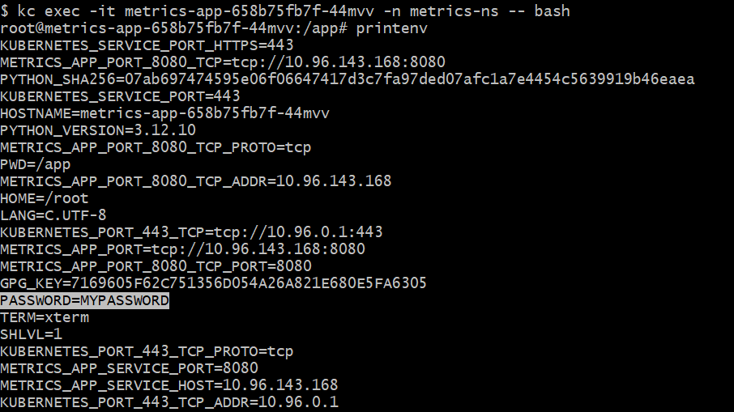

# 🚀 SRE Assignment: Metrics App Deployment

## 🧩 Objective

Deploy a containerized app that exposes a `/counter` endpoint using **Helm**, **ArgoCD** and **KIND**, and Observe the behavior of the `/counter` ,note any anomalies or inconsistent responses, document your debugging process.

---

## 📋 Requirements

- Docker
- kubectl
- KIND (Kubernetes in Docker)
- Helm, Helm Diff plugin


---

## 🗂️ Project Structure

```
.
├── metrics-app/           # Helm chart for the app
├── argocd/
│   └── argo-app.yaml      # ArgoCD application manifest
├── configs/
│   └── kind-config.yaml   # KIND cluster config
│   └── ns.yaml            # namespaces config
├── debug/
│   └── Debugging.md       # Root cause analysis and debugging
│   └── *.png              # screenshots
├── bootstrap.sh           # Full cluster + app setup script
├── README.md              # This file
```
## Create the Stack
```
./bootstrap.sh
```

## Environment Variable Check


## Clean up the Stack
```
kind delete cluster --name sreassign
```