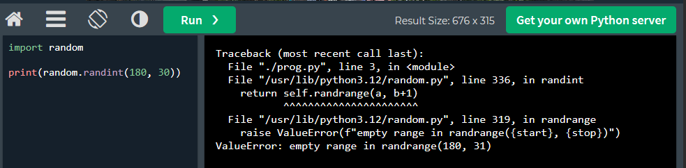
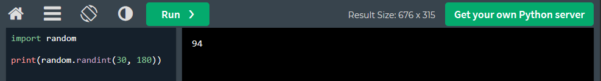

# error found via pod logs
kc logs metrics-app-658b75fb7f-d7r67 -n metrics-ns

# Issue Summary
```
[2025-05-04 03:09:16,109] ERROR in app: Exception on /counter [GET]
Traceback (most recent call last):
  File "/usr/local/lib/python3.12/site-packages/flask/app.py", line 1511, in wsgi_app
    response = self.full_dispatch_request()
               ^^^^^^^^^^^^^^^^^^^^^^^^^^^^
  File "/usr/local/lib/python3.12/site-packages/flask/app.py", line 919, in full_dispatch_request
    rv = self.handle_user_exception(e)
         ^^^^^^^^^^^^^^^^^^^^^^^^^^^^^
  File "/usr/local/lib/python3.12/site-packages/flask/app.py", line 917, in full_dispatch_request
    rv = self.dispatch_request()
         ^^^^^^^^^^^^^^^^^^^^^^^
  File "/usr/local/lib/python3.12/site-packages/flask/app.py", line 902, in dispatch_request
    return self.ensure_sync(self.view_functions[rule.endpoint])(**view_args)  # type: ignore[no-any-return]
           ^^^^^^^^^^^^^^^^^^^^^^^^^^^^^^^^^^^^^^^^^^^^^^^^^^^^^^^^^^^^^^^^^
  File "/app/app.py", line 17, in counter_page
    metrics.trigger_background_collection()
  File "/app/metrics.py", line 6, in trigger_background_collection
    delay = random.randint(180, 30)
            ^^^^^^^^^^^^^^^^^^^^^^^
  File "/usr/local/lib/python3.12/random.py", line 336, in randint
    return self.randrange(a, b+1)
           ^^^^^^^^^^^^^^^^^^^^^^
  File "/usr/local/lib/python3.12/random.py", line 319, in randrange
    raise ValueError(f"empty range in randrange({start}, {stop})")
ValueError: empty range in randrange(180, 31)
10.244.0.6 - - [04/May/2025 03:09:16] "GET /counter HTTP/1.1" 500 -
```

# Where the Error Occurred
This is invalid because random.randint(a, b) expects a <= b. But here, 180 > 30
so Python raises a -- ValueError: empty range in randrange(180, 31)
This is causing the 500 Internal Server Error

# Suggested Fix
Fix the incorrect random.randint() call by swapping the values so the lower value comes first:

# Wrong 
delay = random.randint(180, 30)


# Correct
delay = random.randint(30, 180)


# Limitations
As bug is coming from application itself it is the responsibility of application owner(development team) to fix the same, as far as infra is concern application stack is up and we can provide application logs pointing to the exact exception.

# Below steps can be performed by the development team:
Fix the issue on the application side
Trigger CI pipeline (Includes docker image build and push to non-prod registry)
Deployment and Testing on Dev environment
Promotion to the QA environment

# Below steps can be perfomed by QA Team
Perform QA
Finally upon successful QA, promting image to Production environment

# Below Steps can be performed by Change Co-ordinator
Prod CR creation and planning for production deployment

# Below steps can be performed by DevOps Team
Production Deployment Trigger CD pipeline

